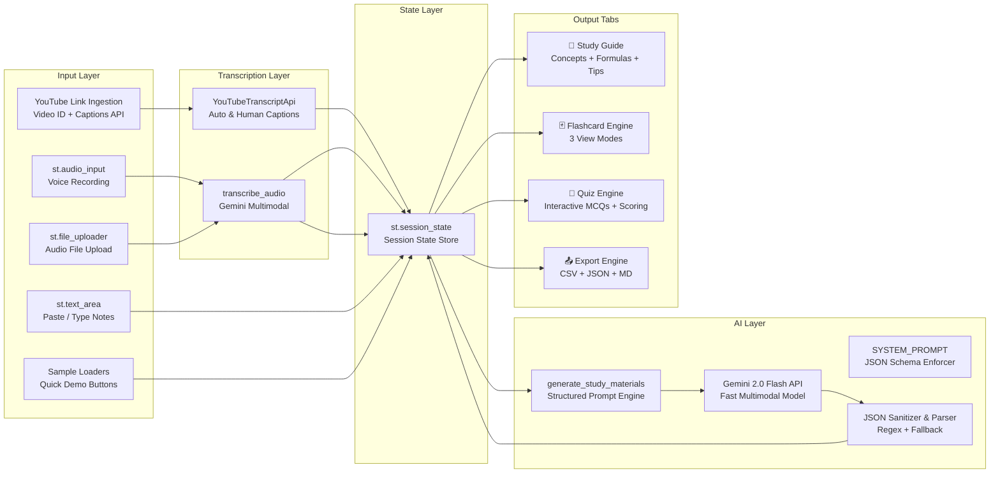

# EchoStudy · Technical Design Document

**Project:** Voice-Notes to Flashcards  
**Capstone Category:** B — EdTech & Campus Survival  
**Problem Statement:** #8  
**Version:** 1.0.0  
**Date:** 2025

---

## 1. System Overview

EchoStudy is a multimodal Streamlit application that accepts YouTube video URLs, live voice recordings (via `st.audio_input`), audio files, or typed notes, processes them with Google Gemini 2.0 Flash (with multimodal audio and captions processing), and generates a complete study package: a structured study guide, 8 difficulty-rated exam flashcards, and a 5-question interactive MCQ quiz with instant feedback.

---

## 2. Architecture Diagram



---

## 3. Data Flow

### 3.1 Voice Path (Multimodal)
1. Student records voice via `st.audio_input` — returns a `BytesIO` object
2. `.read()` extracts raw bytes
3. `transcribe_audio()` creates a multipart request: `[audio_part, text_instruction]`
4. Gemini transcribes audio → returns clean text string
5. Text stored in `st.session_state.transcript_text`

### 3.2 Text Path
1. Student pastes notes in `st.text_area` inside `st.form`
2. On form submit, text is read directly — no API call for transcription
3. Stored in `st.session_state.transcript_text`

### 3.3 Study Pack Generation
1. `generate_study_materials(transcript, subject)` builds the prompt:
   ```
   f"Today: {today}\nSubject: {subject}\n\n--- LECTURE NOTES ---\n{transcript}\n--- END ---"
   ```
2. Prompt sent to Gemini with `SYSTEM_PROMPT` as `system_instruction`
3. Response cleaned with `re.sub()` (strip markdown fences)
4. `json.loads()` parses into dict with keys: `study_guide`, `flashcards`, `quiz`
5. All three stored in `st.session_state`

---

## 4. AI Integration Strategy

### 4.1 Dual Gemini Usage
| Call | Model | Purpose |
|------|-------|---------|
| `transcribe_audio()` | `gemini-1.5-flash` | Audio bytes → clean text (multimodal) |
| `generate_study_materials()` | `gemini-1.5-flash` + system_instruction | Text → structured JSON study pack |

### 4.2 System Prompt Design
The `SYSTEM_PROMPT` enforces:
- Output format: pure JSON only, no markdown fences
- Exact counts: always 8 flashcards, always 5 quiz questions
- Quality rules: exam-style questions, plausible MCQ distractors
- Difficulty assignment criteria for flashcards
- Estimated read time calculation formula

### 4.3 Prompt Engineering Techniques
| Technique | Implementation |
|-----------|---------------|
| System instruction | Strict JSON schema with field-level descriptions |
| Dynamic injection | f-string: date + subject + transcript |
| Count enforcement | "EXACTLY 8 flashcards and EXACTLY 5 quiz questions always" |
| Quality enforcement | "distractors must be plausible (not obviously wrong)" |
| Cleaning instruction | "clean up filler words and stutters silently" |
| Model singleton | `gemini_model` cached in session state, resets on key change |

---

## 5. State Management (20 Keys)

```
st.session_state
├── Core
│   ├── api_key_set       : bool
│   ├── api_key           : str
│   └── gemini_model      : GenerativeModel (cached singleton)
│
├── Content
│   ├── transcript_text   : str   — raw notes / transcription
│   ├── subject           : str   — user-provided subject hint
│   ├── study_guide       : dict  — overview, concepts, tips
│   ├── flashcards        : list  — 8 flashcard dicts
│   └── quiz_questions    : list  — 5 MCQ dicts
│
├── Session Analytics
│   ├── analysis_done     : bool
│   ├── run_count         : int
│   └── last_run_ts       : str
│
├── Flashcard Navigation
│   ├── fc_index          : int   — current card index
│   └── fc_show_answer    : bool  — toggle answer visibility
│
├── Quiz Engine
│   ├── quiz_active       : bool
│   ├── quiz_index        : int   — current question index
│   ├── quiz_score        : int
│   ├── quiz_answers      : dict  — {q_index: chosen_option}
│   └── quiz_finished     : bool
│
└── UI
    └── input_mode        : str   — "audio" | "text"
```

---

## 6. Module Logic

### `init_state()`
Idempotent initialiser — sets all 20 keys on first load using a defaults dict. Safe to call on every rerun.

### `get_model()`
Lazy singleton — initialises `GenerativeModel` once, caches in session state. Resets when API key changes (detected by setting `gemini_model = None`).

### `transcribe_audio(audio_bytes)`
Multimodal Gemini call: constructs a list `[audio_part_dict, text_instruction]` and sends to `gemini-1.5-flash`. Returns raw transcription string.

### `generate_study_materials(transcript, subject)`
Builds f-string prompt → calls cached model → strips markdown fences → `json.loads()` → returns complete dict.

### `reset_quiz()`
Resets all 5 quiz state keys atomically. Called on "Start Quiz" and "Retry Quiz".

### `difficulty_badge(diff)`
Pure function: maps difficulty string → HTML badge with appropriate CSS class. Used inline in flashcard renders.

---

## 7. Flashcard Engine (3 View Modes)

| Mode | Component | Features |
|------|-----------|---------|
| One at a Time | Custom HTML card | Navigation, reveal/hide answer, random card |
| All Cards | `st.expander` per card | Difficulty filter, side-by-side Q&A layout |
| Card Table | `st.data_editor` | Editable, typed columns, sortable |

---

## 8. Quiz Engine State Machine

```
[Not Started] → (Start Quiz button) → [In Progress]
                                          ↓
                               [Question N displayed]
                                          ↓
                               [User clicks option]
                                          ↓
                            [Answer recorded in quiz_answers]
                          [Score incremented if correct]
                                          ↓
                        [Explanation shown, Next button appears]
                                          ↓
                         [Last question?] → YES → [Finished]
                                         → NO  → [Question N+1]
[Finished] → (Retry button) → [Not Started]
```

---

## 9. Deployment Configuration

### requirements.txt
| Package | Version | Rationale |
|---------|---------|-----------|
| `streamlit` | 1.35.0 | Stable `st.audio_input` support |
| `google-generativeai` | 0.7.2 | Multimodal audio + system_instruction |
| `pandas` | 2.2.2 | DataFrame for `st.data_editor` + CSV export |

Zero system-level dependencies. No `portaudio`, `pyaudio`, `ffmpeg`, or OS-specific packages.

### Audio Note
`st.audio_input` captures audio directly in the browser and returns a `BytesIO` — no server-side audio libraries needed. The raw bytes are sent directly to Gemini's multimodal API.

---

## 10. Error Handling

| Scenario | Handler |
|----------|---------|
| No input on submit | `st.error` — no API call made |
| Notes too short (<20 words) | `st.warning` with guidance |
| Audio transcription fails | `st.error` with fallback suggestion to use text mode |
| JSON parse failure | `except json.JSONDecodeError` → `st.error` |
| Generic API error | `except Exception` → display error string |
| Missing JSON keys | `.get()` with defaults everywhere — no `KeyError` possible |

---

*MirAI School of Technology · B.Tech Capstone 2025*
