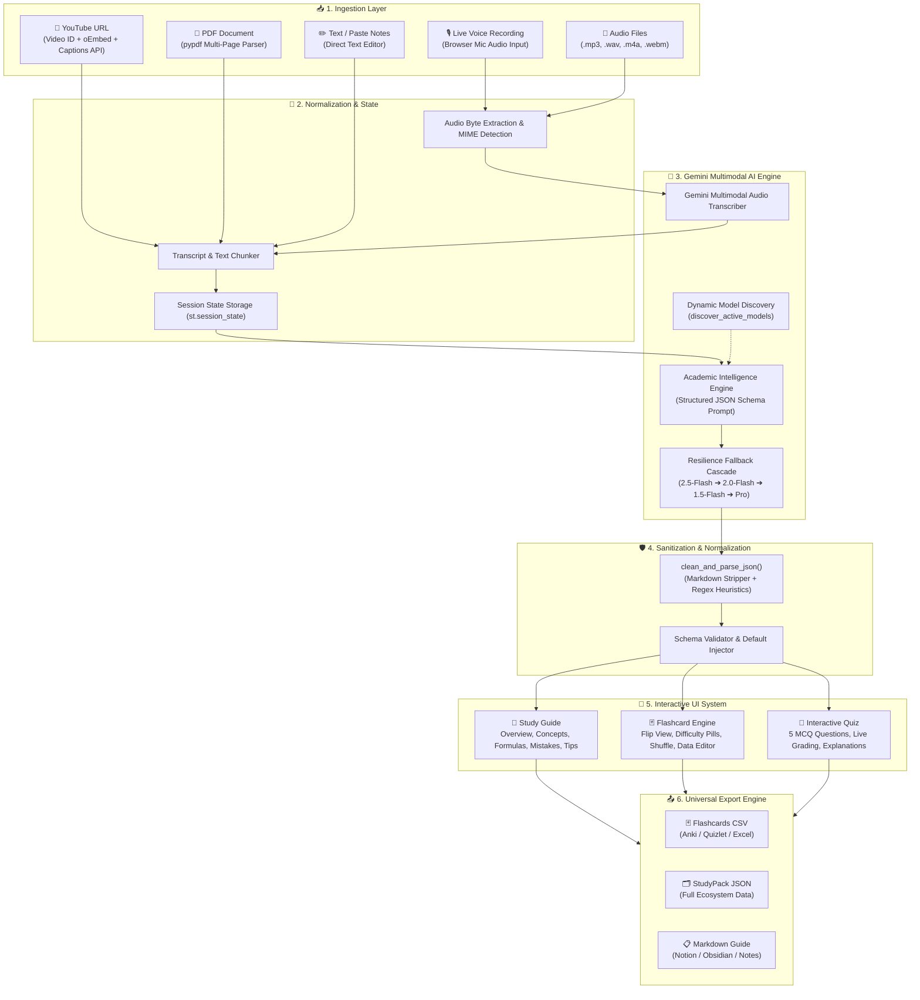

# 🎙️ EchoStudy — Multimodal AI Study Pack Generator

<div align="center">

```
███████╗ ██████╗██╗  ██╗ ██████╗ ███████╗████████╗██╗   ██╗██████╗ ██╗   ██╗
██╔════╝██╔════╝██║  ██║██╔═══██╗██╔════╝╚══██╔══╝██║   ██║██╔══██╗╚██╗ ██╔╝
█████╗  ██║     ███████║██║   ██║███████╗   ██║   ██║   ██║██║  ██║ ╚████╔╝
██╔══╝  ██║     ██╔══██║██║   ██║╚════██║   ██║   ██║   ██║██║  ██║  ╚██╔╝
███████╗╚██████╗██║  ██║╚██████╔╝███████║   ██║   ╚██████╔╝██████╔╝   ██║
╚══════╝ ╚═════╝╚═╝  ╚═╝ ╚═════╝ ╚══════╝   ╚═╝    ╚═════╝ ╚═════╝    ╚═╝
```

**Convert Lecture Voice, YouTube Videos, PDF Notes, and Transcripts into Complete Interactive Study Packs in Seconds**

[](https://www.python.org/)
[](https://streamlit.io/)
[](https://aistudio.google.com/)
[](https://github.com/)
[](LICENSE)

[🌟 Live App](#-quickstart) • [✨ Key Features](#-key-features) • [🏗️ Architecture](#️-system-architecture) • [🚀 Quickstart](#-quickstart) • [📖 User Guide](#-user-guide) • [⚙️ Technical Specifications](#️-technical-specifications)

</div>

---

## 📌 Executive Summary

**EchoStudy** is an elite academic intelligence platform that bridges the gap between raw, unstructured learning materials and high-yield active recall studying. Built on top of Google's state-of-the-art **Gemini Multimodal AI**, EchoStudy digests multi-format academic inputs—including **YouTube video lectures**, **multi-page PDF slides & notes**, **live microphone recordings**, **audio files**, and **raw text**—and instantly transforms them into an integrated, interactive **Study Pack**.

Each generated Study Pack contains:
1. 📖 **A Structured Study Guide** with executive overviews, key concept definitions, real-world examples, mathematical formulas, misconceptions to avoid, and high-yield exam tips.
2. 🃏 **8 Active Recall Flashcards** categorized by difficulty and topic tags, featuring flip/reveal views, random shuffle, and interactive table editing.
3. 🧠 **An Interactive 5-Question MCQ Quiz** complete with live scoring, instant feedback, rationale explanations, and comprehensive performance analytics.
4. 📤 **Universal Export Engines** supporting Anki/Quizlet CSV, full JSON packages, and formatted Markdown for Notion & Obsidian.

---

## ✨ Key Features

### 1. 🎛️ 5 Multi-Modal Ingestion Pipelines
* 🎥 **YouTube Video to StudyPack:** Paste any YouTube lecture, tutorial, or educational video link. EchoStudy parses the video ID, fetches titles via oEmbed without API keys, retrieves transcripts via `YouTubeTranscriptApi`, and embeds a live video player.
* 📄 **PDF Notes Document Ingestion:** Upload lecture slides, research papers, or chapter notes (`.pdf`). Multi-page text extraction powered by `pypdf` extracts text page-by-page, computes total word counts, and automatically infers subject titles.
* 🎙️ **Live Microphone Recording:** Record voice lectures directly inside the browser using Streamlit's native audio input. Transcribed via Gemini Multimodal Audio Processing.
* 📁 **Pre-Recorded Audio Upload:** Ingest pre-recorded audio lectures in `.mp3`, `.wav`, `.m4a`, `.ogg`, or `.webm` formats with automatic MIME type detection.
* ✏️ **Type / Paste Notes:** Direct input for lecture notes, article summaries, or textbook transcripts.

### 2. 🤖 Gemini Resilience & Dynamic Model Discovery
* **Live Model Discovery:** EchoStudy queries Google AI Studio live on startup to detect the exact models activated and permitted on your key (`gemini-2.5-flash`, `gemini-2.0-flash`, `gemini-1.5-flash`, `gemini-2.5-pro`, `gemini-1.5-pro`).
* **Multi-Model Fallback Cascade:** If a selected model experiences temporary rate limits or `404 NOT_FOUND` errors, EchoStudy seamlessly routes the request to an active fallback model.
* **Auto-Recovery JSON Parser:** Cleans, sanitizes, and normalizes model output to ensure schema compliance even with imperfect model completions.

### 3. 🎨 Modern Light Design System & Typography
* **Professional Light Aesthetic:** Clean white cards (`#ffffff`), slate-white background (`#f8fafc`), and Electric Indigo accents (`#6366f1`).
* **Strict Typography Hierarchy:**
  * **Headings:** **Bold (`font-weight: 700 / 800`)**, deep slate `#0f172a`.
  * **Subheadings:** **Semi-bold (`font-weight: 600`)**, `#334155` / `#6366f1`.
  * **Normal Body Text:** **Regular (`font-weight: 400`)**, `#334155` with 1.7 line-height.
* **Zero UI Glitches:** Clean expanders and icon ligatures with zero overlapping icon text.

### 4. 🧪 1-Click Quick Demos
* **⚡ Load Sample Notes (OS):** Operating Systems Process Scheduling (FCFS, SJF, Round Robin, Priority, Multilevel Queue).
* **📄 Load Sample PDF (DBMS ACID):** 3-Page Database Systems lecture on Transactions, ACID properties, Serializability, 2PL, and WAL.
* **🎥 Load Sample YouTube (Neural Nets):** 3Blue1Brown's Chapter 1 Deep Learning lecture.

---

## 🏗️ System Architecture



---

## 🚀 Quickstart

### Prerequisites
* **Python 3.10, 3.11, or 3.12**
* A **Google Gemini API Key** (Free from [Google AI Studio](https://aistudio.google.com))

### 1. Clone the Repository
```bash
git clone https://github.com/your-username/EchoStudy.git
cd EchoStudy
```

### 2. Create and Activate a Virtual Environment
```bash
# macOS / Linux
python3 -m venv venv
source venv/bin/activate

# Windows
python -m venv venv
venv\Scripts\activate
```

### 3. Install Dependencies
```bash
pip install -r requirements.txt
```

### 4. Run the Application
```bash
streamlit run app.py
```

The application will launch locally at **`http://localhost:8501`** (or `8502`).

---

## 📖 User Guide

### Step 1: Provide Your Gemini API Key
Enter your Gemini API key in the left sidebar under **⚙ Configuration**. The app will automatically discover available models on your account.

### Step 2: Choose Your Input Source
Navigate to the **📥 Input & Generation** tab and select one of the 5 input modes:
* **YouTube Link:** Paste a video URL and click **📥 Fetch Video Transcript**.
* **PDF Notes:** Drag & drop any `.pdf` lecture slide or notes file.
* **Voice Recording:** Click the microphone icon to record your thoughts or lecture summary.
* **Type / Paste Notes:** Paste raw notes, textbook summaries, or lecture transcripts.
* **Upload Audio:** Upload pre-recorded audio lectures.

### Step 3: Generate Your Study Pack
Click **⚡ Generate Study Pack**. EchoStudy's AI engine analyzes the content, structures the knowledge base, and outputs the materials in under 5 seconds.

### Step 4: Explore & Study
* **📖 Study Guide:** Read the concise summary, explore expandable concept definitions and examples, review mathematical formulas, and study high-yield exam tips.
* **🃏 Flashcards:** Practice active recall with flip cards, filter by difficulty (Easy/Medium/Hard), or edit the cards directly in the data table.
* **🧠 Quiz:** Test your knowledge with 5 randomized multiple-choice questions with instant scoring, feedback, and answer explanations.
* **📤 Export:** Download your materials as **Anki CSV**, **StudyPack JSON**, or **Notion/Obsidian Markdown**.

---

## 🗂️ Project Structure

```
EchoStudy/
├── app.py                  # Main Streamlit application with full UI & logic
├── requirements.txt        # Python dependencies
├── config.toml             # Streamlit theme & server configuration
├── DESIGN.md               # Technical specification & system design document
├── README.md               # Project documentation
├── .streamlit/
│   └── config.toml         # Streamlit internal configuration
└── assets/                 # Screenshots & visual assets
```

---

## 📦 Dependencies

| Package | Version | Purpose |
| :--- | :--- | :--- |
| **`streamlit`** | `>=1.35.0` | Modern reactive frontend framework |
| **`google-genai`** | `>=1.0.0` | Official Google GenAI SDK (Gemini 2.5/2.0/1.5) |
| **`google-generativeai`** | `>=0.8.3` | Legacy SDK compatibility fallback |
| **`pypdf`** | `>=4.0.0` | Multi-page PDF text extraction |
| **`youtube-transcript-api`** | `>=0.6.2` | YouTube automated & manual caption extraction |
| **`requests`** | `>=2.31.0` | HTTP requests & oEmbed video metadata fetching |
| **`pandas`** | `>=2.2.2` | Data manipulation & CSV export generation |

---

## ⚙️ Technical Specifications

### Input Limitations & Benchmarks
* **YouTube Ingestion:** Supports any YouTube video with enabled captions in English (or auto-translated).
* **PDF Ingestion:** Supports multi-page standard PDF documents up to 50MB.
* **Audio Ingestion:** Supports `.wav`, `.mp3`, `.m4a`, `.ogg`, `.webm` files up to 200MB.
* **Generation Speed:** ~2.5 - 4.5 seconds for complete Study Pack generation.
* **Output Standards:** Guaranteed 8 Flashcards + 5 MCQ Quiz Questions + Comprehensive Study Guide.

---

## 🛡️ License

Distributed under the **MIT License**. See `LICENSE` for more information.

---

<div align="center">
  <b>EchoStudy AI</b> — Built with ❤️ for Students & Educators Worldwide
</div>
